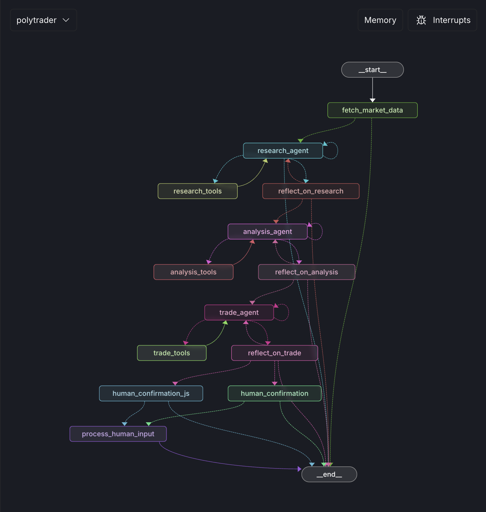
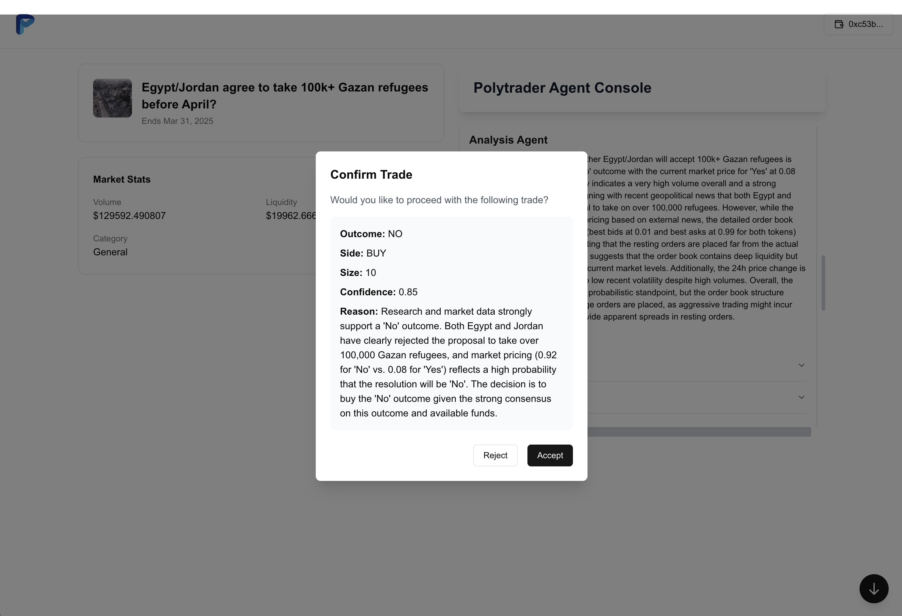
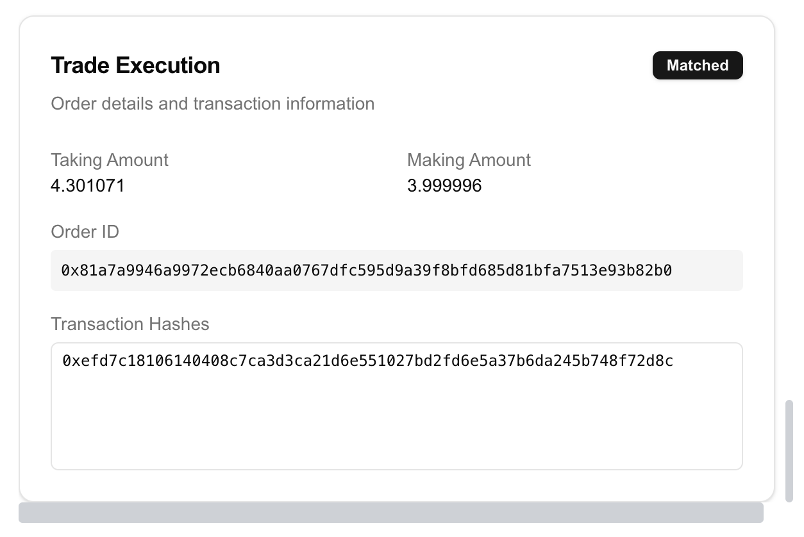

# Polytrader AI Project

## Overview

Welcome to the Polytrader AI project! This repository consists of two main parts:

- **backend/**: A Python-based AI agent using LangChain, LangGraph, and related libraries to analyze and trade on Polymarket.
- **frontend/**: A Next.js application with TailwindCSS, Shadcn UI, and TypeScript for the user-facing interface.

Poly is the trading agent, and it is capable of:

- Performing deep research on a given market using [Exa](https://exa.ai/) and a recursive process to ask better and more refined questions about the market in question.
  - Inspiration for my implementation of Deep Research comes from `dzhng/deep-research`, which can be found [here](https://github.com/dzhng/deep-research).
- Analyze the market conditions, and produce a summary of the current state of the market.
- Decide whether to buy, sell, or hold a position, based on the market conditions and the agent's own analysis.

On the web app, you can see the agent's thought process and, if it does decide to make a trade, you can confirm or reject the trade.

## Screenshots








## Getting Started (High-Level)

1. **Clone this repository**

   ```bash
   git clone https://github.com/YourUser/polytrader.git
   cd polytrader
   ```

2. Set up Environment Variables

Copy `.env.example` in the `backend/` directory (and similarly .env.example in `frontend/` if available) to `.env` (or `.env.local` for the frontend), then fill in the required values.
For the backend, ensure the environment variables that your agent or Graph nodes need (like API keys) are properly populated.
For the frontend, any variables you need at build time can be placed in `.env.local` or shared with `NEXT_PUBLIC_` prefix. Backend Setup
See `backend/README.md` for details on installing Python dependencies, running the AI agent, or using the LangGraph server.

3. Frontend Setup
   See `frontend/README.md` for more information about installing Node.js dependencies and starting the Next.js dev server.

4. Running Locally
   - Backend: Typically run `make lg-server` from the `backend/` directory to start the agent’s local dev environment.
   - Frontend: From the `frontend/` folder, install dependencies with `pnpm install` and run `pnpm dev`.

## What you will need

- OpenAI API key
- Exa API key
- Tavily (not actively being used) API key
- Web3 wallet (e.g. MetaMask, Phantom, etc.)

## Configuring Polymarket

A detailed guide on how to configure Polymarket can be found in the `backend/README.md` file, [here](backend/README.md#configuring-polymarket).

## Structure

```
├── backend/
│ ├── src/
│ ├── tests/
│ ├── Makefile
│ ├── ...
│ └── pyproject.toml
├── frontend/
│ ├── app/
│ ├── components/
│ ├── lib/
│ ├── types/
│ ├── ...
│ ├── package.json
│ └── pnpm-lock.yaml
└── README.md (this file)
```
