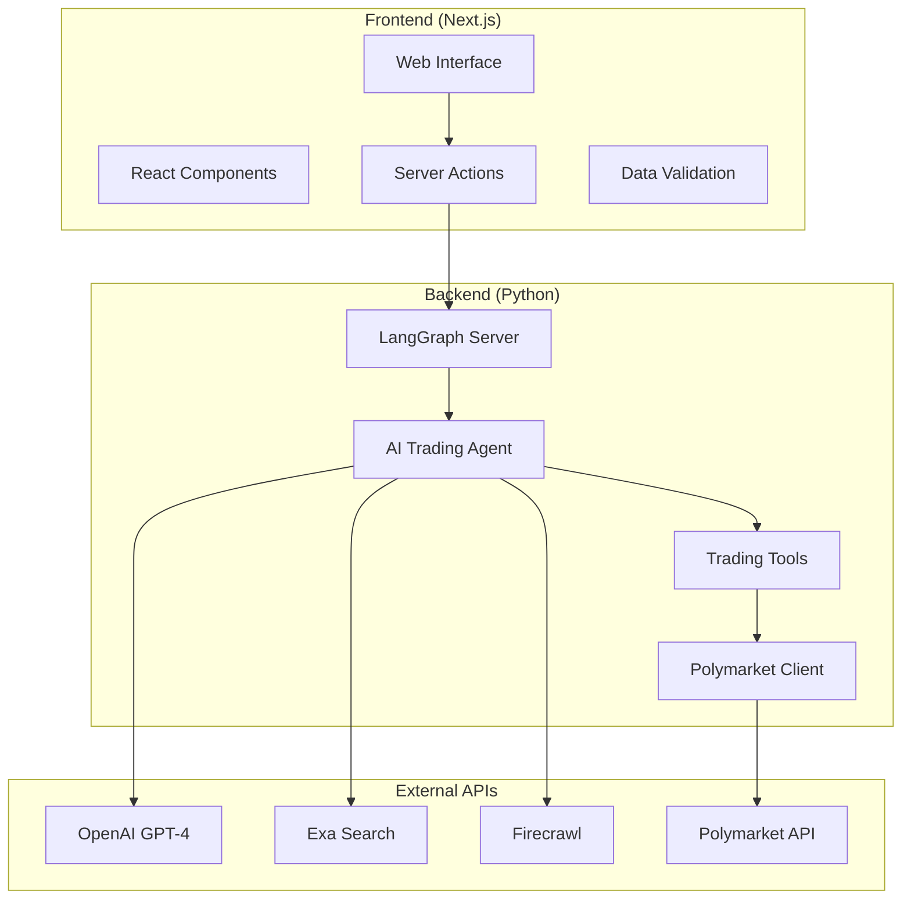

# PolyTrade Project Architecture

## System Overview

PolyTrade is a sophisticated AI-powered trading system for Polymarket prediction markets. The architecture follows a modern microservices approach with clear separation between the AI backend and user interface.



## Backend Architecture

### Core Components

#### 1. LangGraph Server (`backend/src/polytrader/graph.py`)
- **Purpose**: Orchestrates the AI agent workflow
- **Technology**: LangGraph framework
- **Port**: 8123 (default)
- **Endpoints**:
  - `/runs` - Start new agent runs
  - `/runs/{run_id}/stream` - Stream agent execution
  - `/runs/{run_id}/state` - Get current state

#### 2. AI Trading Agent
The agent follows a multi-stage workflow:

```python
# Agent Workflow Stages
Research → Analysis → Decision → Execution
```

**Research Agent** (`polytrader/prompts.py`)
- Gathers market intelligence using Exa and Firecrawl
- Performs recursive research with refined questions
- Collects news, social sentiment, and market data

**Analysis Agent**
- Processes research data using GPT-4
- Analyzes market sentiment and trends
- Identifies key factors affecting market outcomes

**Trade Agent**
- Makes buy/sell/hold recommendations
- Calculates position sizes and risk levels
- Provides detailed reasoning for decisions

#### 3. State Management (`backend/src/polytrader/state.py`)
```python
@dataclass
class AgentState:
    market_id: str
    research_data: List[ResearchItem]
    analysis_summary: str
    trade_decision: TradeDecision
    execution_status: str
```

#### 4. Trading Tools (`backend/src/polytrader/tools.py`)
- Market data fetching
- Position management
- Order execution
- Risk calculations

#### 5. Polymarket Integration (`backend/src/polytrader/polymarket.py`)
- CLOB (Central Limit Order Book) client
- Wallet management
- Transaction signing
- Position tracking

### Configuration System (`backend/src/polytrader/configuration.py`)

```python
@dataclass
class Configuration:
    model: str = "openai/gpt-4o-mini"
    temperature: float = 0.5
    max_search_results: int = 10
    max_loops: int = 6
```

## Frontend Architecture

### Core Structure

#### 1. Next.js App Router (`frontend/app/`)
```
app/
├── page.tsx              # Home page
├── layout.tsx            # Root layout
├── markets/              # Market pages
│   └── [id]/page.tsx    # Individual market
└── profile/              # User profile
    └── page.tsx
```

#### 2. Component Architecture (`frontend/components/`)

**UI Components** (`components/ui/`)
- Built with Radix UI and Tailwind CSS
- Reusable design system components
- Accessible and responsive

**Feature Components**
- `decision-card.tsx` - Trade decision display
- `market-selector.tsx` - Market selection interface
- `agent-stream.tsx` - Real-time agent streaming
- `error-boundary.tsx` - Error handling

#### 3. Data Layer (`frontend/lib/`)

**Actions** (`lib/actions/`)
```typescript
// Server actions for backend communication
export async function streamAgentAnalysis(marketId: string)
export async function getMarketData(marketId: string)
export async function executeTradeDecision(decision: TradeDecision)
```

**Utilities** (`lib/utils/`)
- `data-validation.ts` - Type-safe data validation
- `logger.ts` - Structured logging
- `utils.ts` - General utilities

#### 4. Type System (`frontend/types/`)
```typescript
// Agent run types
interface AgentRunData {
  id: string;
  status: 'running' | 'completed' | 'error';
  marketId: string;
  decision?: TradeDecision;
}

// Stream event types
interface StreamEvent {
  type: 'research' | 'analysis' | 'decision';
  data: any;
  timestamp: string;
}
```

## Data Flow

### 1. User Interaction Flow
```
User selects market → Frontend validates → Server action called → 
Backend receives request → Agent starts execution → 
Real-time streaming to frontend → User sees progress → 
Decision presented → User approves/rejects → Trade executed
```

### 2. Agent Execution Flow
```python
# Simplified agent workflow
def agent_workflow(state: AgentState):
    # Research phase
    research_data = research_agent.run(state.market_id)
    
    # Analysis phase  
    analysis = analysis_agent.run(research_data)
    
    # Decision phase
    decision = trade_agent.run(analysis)
    
    # Return updated state
    return AgentState(
        market_id=state.market_id,
        research_data=research_data,
        analysis_summary=analysis,
        trade_decision=decision
    )
```

### 3. Data Validation Pipeline

**Frontend Validation** (`lib/utils/data-validation.ts`)
```typescript
export function validateTradeInfo(data: unknown): TradeInfo {
  // Runtime type checking and validation
  // Throws DataValidationError on invalid data
}
```

**Backend Validation** (Pydantic models)
```python
class TradeDecision(BaseModel):
    action: Literal["BUY", "SELL", "HOLD"]
    confidence: float = Field(ge=0, le=1)
    reasoning: str
    market_id: str
```

## API Endpoints

### Backend Endpoints (LangGraph Server)

#### Agent Management
- `POST /runs` - Start new agent run
- `GET /runs/{run_id}` - Get run status
- `GET /runs/{run_id}/stream` - Stream run events
- `POST /runs/{run_id}/input` - Send input to running agent

#### Market Data
- `GET /markets` - List available markets
- `GET /markets/{market_id}` - Get market details
- `GET /markets/{market_id}/positions` - Get current positions

#### Trading
- `POST /trades` - Execute trade
- `GET /trades/{trade_id}` - Get trade status
- `GET /portfolio` - Get portfolio summary

### Frontend API Routes

#### Server Actions (`lib/actions/`)
```typescript
// Market actions
export async function getMarkets()
export async function getMarketById(id: string)

// Agent actions  
export async function startAgentRun(marketId: string)
export async function streamAgentAnalysis(runId: string)

// Trading actions
export async function executeTrade(decision: TradeDecision)
export async function getPortfolio()
```

## Security Architecture

### Authentication & Authorization
- Web3 wallet connection (MetaMask, WalletConnect)
- Private key management for trading
- API key security for external services

### Data Security
- Input validation and sanitization
- SQL injection prevention
- XSS protection
- CORS configuration

### Trading Security
- Transaction signing verification
- Position limits and risk management
- Approval workflows for trades
- Audit logging

## Error Handling & Monitoring

### Frontend Error Handling
```typescript
// Error boundaries for React components
<AgentStreamErrorBoundary>
  <AgentStream runId={runId} />
</AgentStreamErrorBoundary>

// Validation error handling
try {
  const validData = validateTradeInfo(rawData);
} catch (error) {
  if (error instanceof DataValidationError) {
    // Handle validation error gracefully
  }
}
```

### Backend Error Handling
```python
# Structured logging with error context
@log_agent_execution
def research_node(state: AgentState) -> AgentState:
    try:
        # Agent logic
        pass
    except Exception as e:
        logger.error("Research node failed", extra={
            "market_id": state.market_id,
            "error": str(e)
        })
        raise
```

### Monitoring Stack
- **Logging**: Structured JSON logs with correlation IDs
- **Metrics**: Performance and business metrics
- **Alerting**: Error rate and performance thresholds
- **Tracing**: Request tracing across services

## Performance Optimization

### Frontend Performance
- **Code Splitting**: Automatic route-based splitting
- **Streaming**: Real-time updates without polling
- **Caching**: React Query for data caching
- **Error Boundaries**: Prevent cascade failures

### Backend Performance
- **Connection Pooling**: Database and API connections
- **Request Limits**: Configurable concurrency limits
- **Timeout Management**: Prevent hanging requests
- **Resource Monitoring**: Memory and CPU tracking

## Deployment Architecture

### Development Environment
```
Local Machine:
├── Backend (localhost:8123)
├── Frontend (localhost:3000)
└── External APIs (remote)
```

### Production Environment
```
Cloud Infrastructure:
├── Backend (containerized)
├── Frontend (CDN + serverless)
├── Database (managed service)
├── Monitoring (observability stack)
└── Load Balancer
```

## Technology Stack Summary

### Backend Technologies
- **Python 3.11+**: Core language
- **LangGraph**: Agent orchestration
- **LangChain**: AI framework
- **FastAPI**: Web framework (via LangGraph)
- **Pydantic**: Data validation
- **Web3.py**: Blockchain interaction

### Frontend Technologies
- **Next.js 15**: React framework
- **TypeScript**: Type safety
- **Tailwind CSS**: Styling
- **Radix UI**: Component primitives
- **React Query**: Data fetching
- **Privy**: Web3 authentication

### External Services
- **OpenAI**: AI model provider
- **Exa**: Search and research
- **Firecrawl**: Web scraping
- **Polymarket**: Trading platform
- **Polygon**: Blockchain network

## Scalability Considerations

### Horizontal Scaling
- Stateless backend services
- Load balancing across instances
- Database read replicas
- CDN for static assets

### Vertical Scaling
- Resource monitoring and auto-scaling
- Performance profiling and optimization
- Caching strategies
- Database optimization

### Future Enhancements
- Multi-agent coordination
- Advanced risk management
- Real-time market data feeds
- Machine learning model integration
